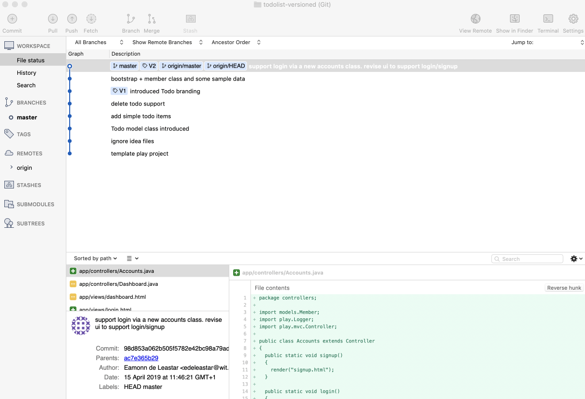

# Accounts Routes + Controllers

To finish the upgrade to accounts - we need this revised routes file (replace the existing one):

## conf/routes

~~~bash
# Routes
# This file defines all application routes (Higher priority routes first)
# ~

GET     /                                       Start.index

# Accounts
GET    /signup                                  Accounts.signup
GET    /login                                   Accounts.login
POST   /register                                Accounts.register
POST   /authenticate                            Accounts.authenticate
GET    /logout                                  Accounts.logout

# Home page
GET     /dashboard                              Dashboard.index
GET     /dashboard/{id}/deletetodo/{todoid}     Dashboard.deleteTodo
GET     /about                                  About.index

# Ignore favicon requests
GET     /favicon.ico                            404

# Map static resources from the /app/public folder to the /public path
GET     /public/                                staticDir:public

# Catch all
*       /{controller}/{action}                  {controller}.{action}

~~~ 

This new controller:

## app/controllers/Accounts.java

~~~java
package controllers;

import models.Member;
import play.Logger;
import play.mvc.Controller;

public class Accounts extends Controller
{
  public static void signup()
  {
    render("signup.html");
  }

  public static void login()
  {
    render("login.html");
  }

  public static void register(String firstname, String lastname, String email, String password)
  {
    Logger.info("Registering new user " + email);
    Member member = new Member(firstname, lastname, email, password);
    member.save();
    redirect("/");
  }

  public static void authenticate(String email, String password)
  {
    Logger.info("Attempting to authenticate with " + email + ":" + password);

    Member member = Member.findByEmail(email);
    if ((member != null) && (member.checkPassword(password) == true)) {
      Logger.info("Authentication successful");
      session.put("logged_in_Memberid", member.id);
      redirect ("/dashboard");
    } else {
      Logger.info("Authentication failed");
      redirect("/login");
    }
  }

  public static void logout()
  {
    session.clear();
    redirect ("/");
  }

  public static Member getLoggedInMember()
  {
    Member member = null;
    if (session.contains("logged_in_Memberid")) {
      String memberId = session.get("logged_in_Memberid");
      member = Member.findById(Long.parseLong(memberId));
    } else {
      login();
    }
    return member;
  }
}
~~~

This is a new version of Dashboard:

## app/controllers/Dashboard.java

~~~java
package controllers;

import models.Member;
import models.Todo;
import play.Logger;
import play.mvc.Controller;

import java.util.List;

public class Dashboard extends Controller
{
  public static void index()
  {
    Logger.info("Rendering Dashboard");
    Member member = Accounts.getLoggedInMember();
    List<Todo> todolist = member.todolist;
    render("dashboard.html", member, todolist);
  }

  public static void addTodo(String title)
  {
    Member member = Accounts.getLoggedInMember();
    Todo todo = new Todo(title);
    member.todolist.add(todo);
    member.save();
    Logger.info("Adding Todo" + title);
    redirect("/dashboard");
  }

  public static void deleteTodo(Long id, Long todoid)
  {
    Member member = Member.findById(id);
    Todo todo = Todo.findById(todoid);
    member.todolist.remove(todo);
    member.save();
    todo.delete();
    Logger.info("Deleting " + todo.title);
    redirect("/dashboard");
  }
}
~~~

See if the app runs now as expected, and that the todo items are kept separate by user. Also verify that we can delete  todos.

Stage and commit all changes in this step - and tag this version 'V2'.

