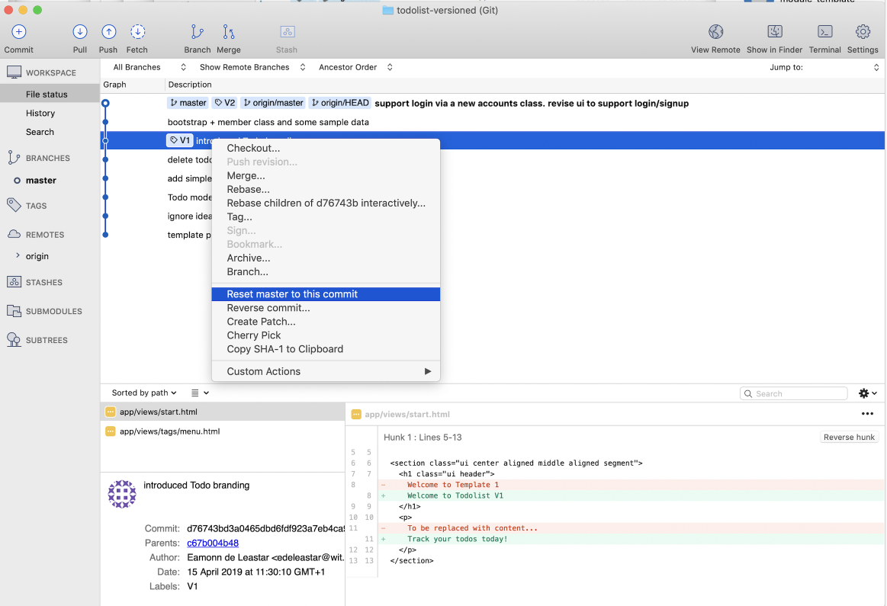
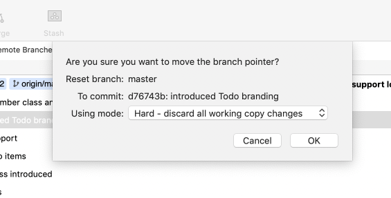
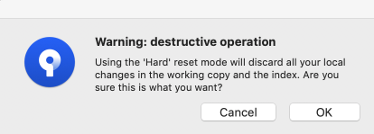
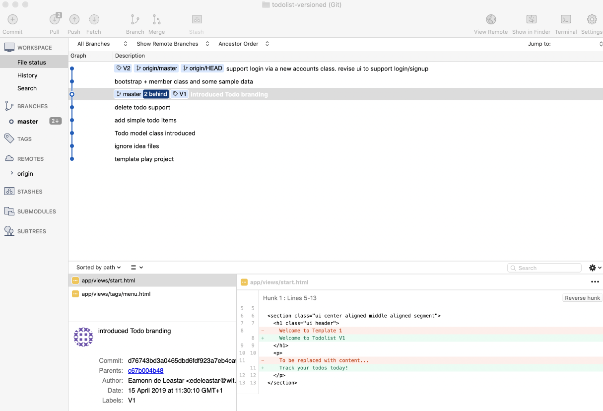

# Exercises

Your repo should be structured something like this one now:

- <https://github.com/wit-hdip-comp-sci-2020/todolist-versioned>

## Exercise 1: Running an Earlier Version

In Sourcetree, select the `V1` tagged commit, right click and select `Reset master to this commit` as shown here:

In the subsequent dialog, select 'Hard - diacard all working copy changes'

You will get a warning - which you can accept:

The project folder will now contain the V1 project. 

You can run this version now - and make sure it is that version (no member support)

Please note you cant really edit this version - or if you do it will involve creating a new branch from this point (something you will learn about later).

## Exercise 2: Get back to the latest version

See if you can get back to V2 - it is more or less the same procedure as getting to V1, but in reverse.

## Exercise 3: : Logout & Images

The logout feature is missing from the menu. Also, the images assets are missing. Locate these form the Lab 10. Once you have the feature implemented, commit and push the modifications (with a suitable message).

