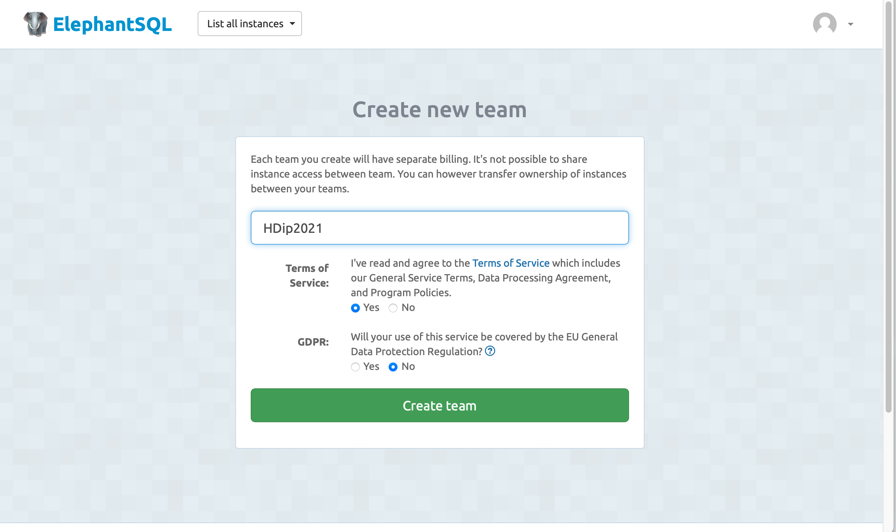

# Setup

We are going to be deploying the Todo app from the last lab:

- <https://github.com/wit-hdip-comp-sci-2020/todolist-versioned/releases/tag/V3>

If you completed that lab, you can continue to use it as the project we will deploy in this lab.

Currently your play application is residing on your own workstations. This is fine for test and development purposes, but the app cannot be used by anyone else yet. You might recall we used surge.sh as the service for Assignment 1. As we are do developing in Java + using a database, we will need to use other cloud services that specialises in these areas.

We will use 2 external services:

- https://www.heroku.com

- https://www.elephantsql.com

Heroku will be used to deploy the *application*, and ElephantSQL for the *database*. Sign up for free accounts on both if these services now. ElephantSQL will allow you to sign in with your GitHub account, Heroku will require a new sign up.

### Heroku

Once confirmed on heroku, log in and go you your Dashboard:

- <https://dashboard.heroku.com/apps>

This is where the applications you create can be configured and monitored. You also need to install the Heroku Command Line Interface.

- <https://devcenter.heroku.com/articles/heroku-cli>

The instructions are above. Note the documentation towards the end on verifying your installation.

### Elephant SQL

Once you have authorised/signed in with GitHub, you will be asked to create a team:

Create any team name you like, and proceed:

