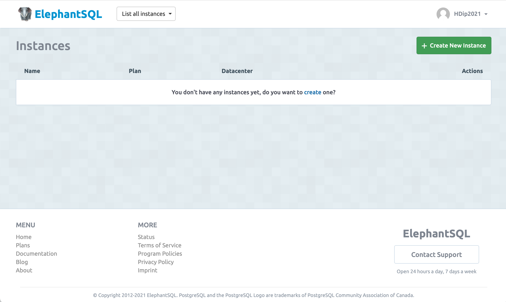
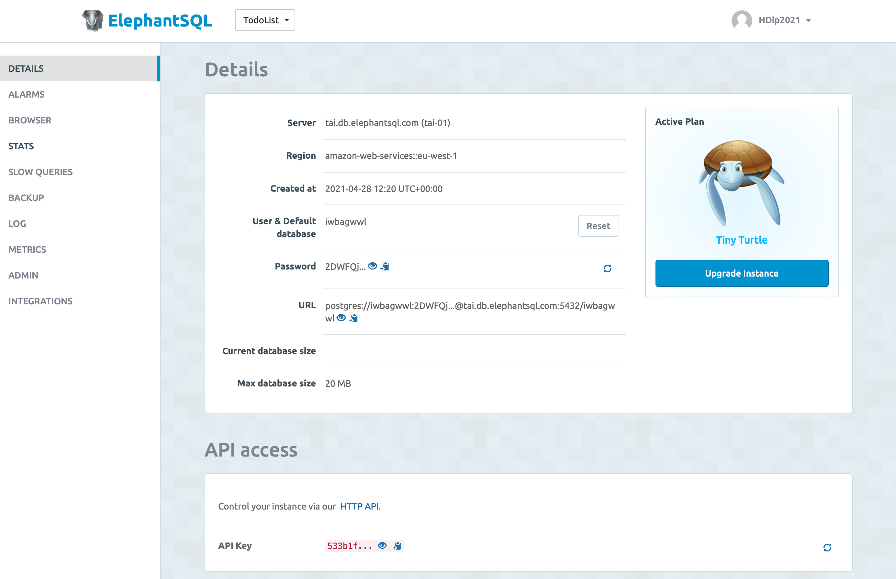

### Database 

In your ElephantSQL console:

Create a new instance:

Give it a name - and keep with the free plan.

Select the Irish region:

Confirm - and the instance will be created:

Open the instance:

We are interested in the URL - which we can copy to the clipboard

Keep this URL in the clipboard for the next step.

