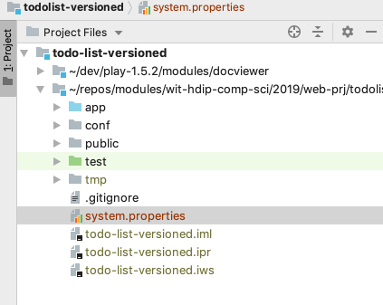
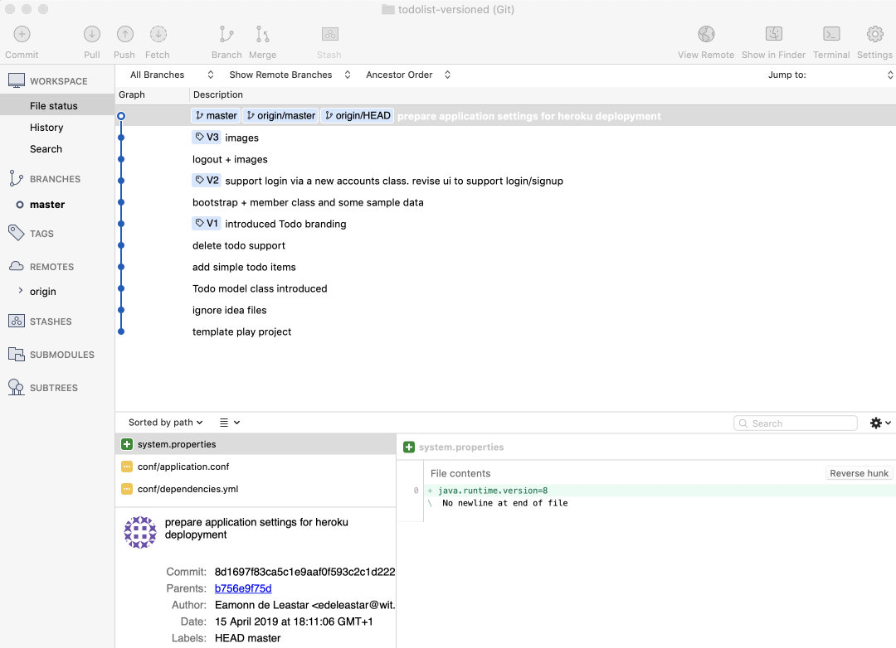

# Preparing the Play Application for Deployment

In order to deploy the application using the Heroku service we need a few more small adjustments. These are:

- Set the JDK Version for Heroku
- Set the Play Version for Heroku
- Switch to Production Mode

### JDK Version

Create a new file in the project root:

### system.properties

~~~
java.runtime.version=11
~~~

This sets the JDK version our app will need when deployed. It might be simplest to use Sublime to create this file - alternatively, you will need to switch to 'Project Files' mode to be able to create and save the file to the correct location.

### Play Version

Locate this file:

## conf/dependencies.yml

~~~bash
# Application dependencies

require:
    - play
~~~

Change it to the following:

~~~bash
# Application dependencies

require:
    - play 1.5.3
~~~

This determines the precise version of Play + the database drivers it should use.

#### Production Mode

Also 'application.conf' - at the top of the file we have this:

~~~
# Application mode
# 
# Set to dev to enable instant reloading and other development help.
# Otherwise set to prod.
application.mode=dev
%prod.application.mode=prod
~~~

This needs to be changed to this:

~~~
# Application mode
# 
# Set to dev to enable instant reloading and other development help.
# Otherwise set to prod.
#application.mode=dev
prod.application.mode=prod
~~~

We are enabling 'production mode' for deployment.

All of the above changes need to be committed, and the pushed to git.

