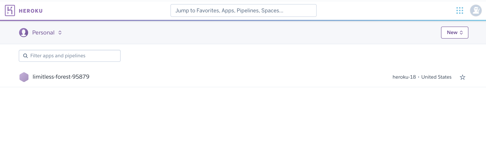
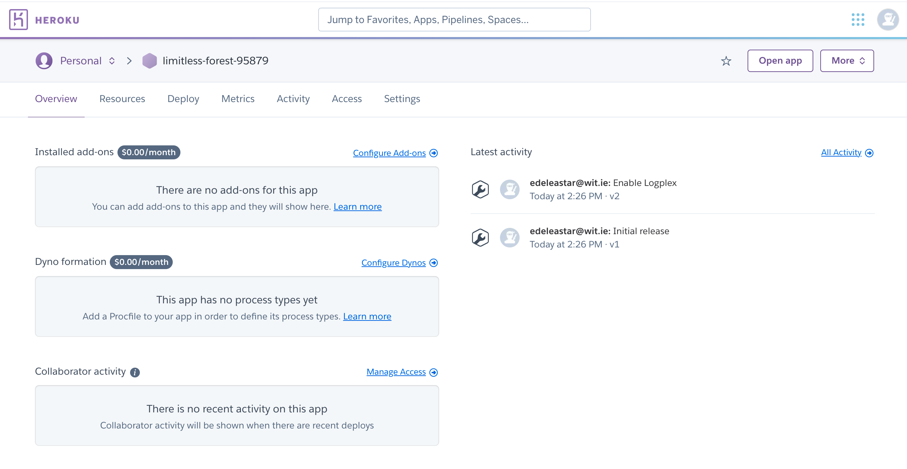
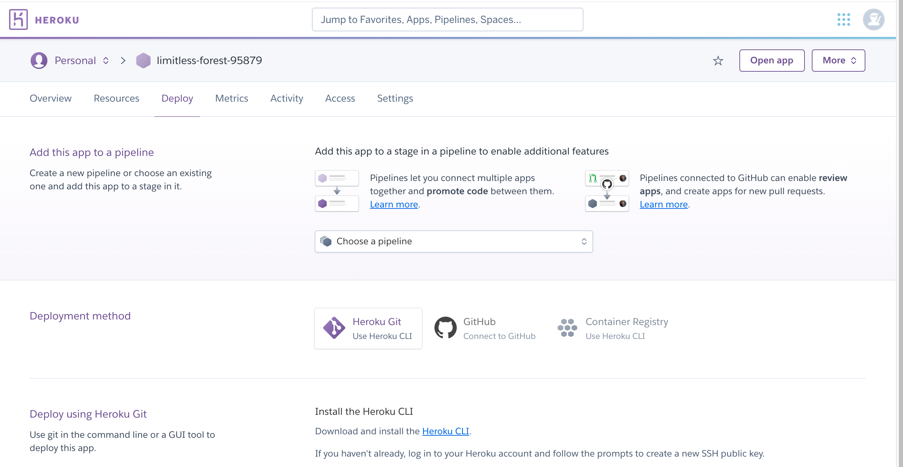
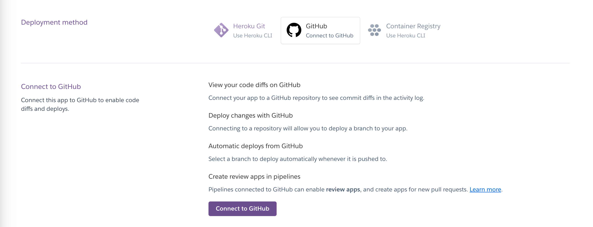
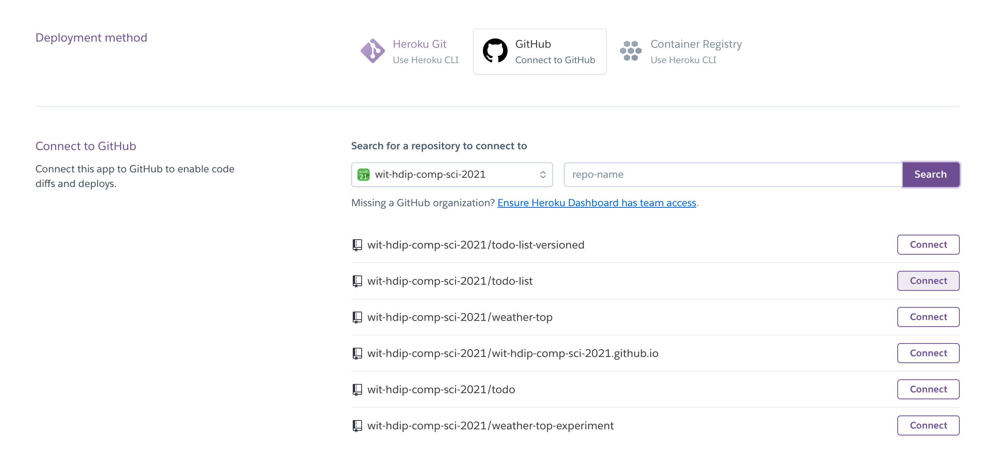
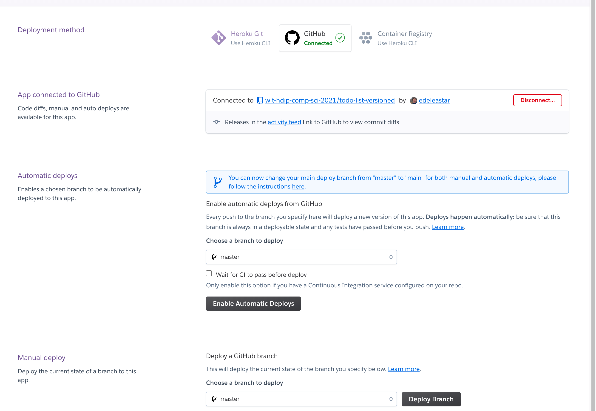
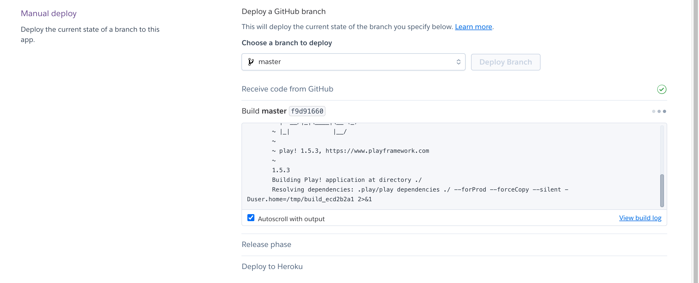
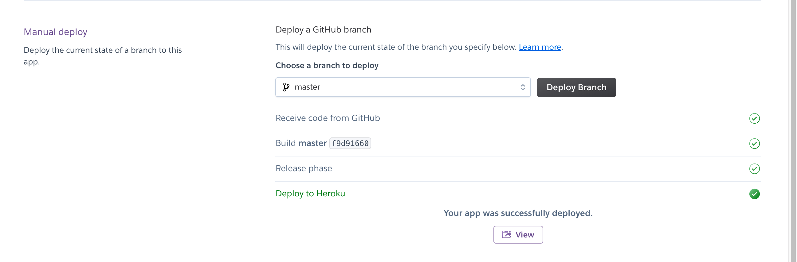
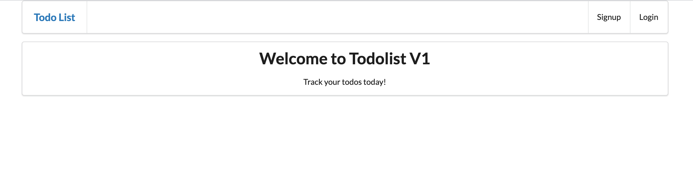

# Creating & Configure the Application on Heroku

Now we need to create and configure the application on Heroku:

- Create and (empty) App
- Link to Github repo
- See if it deplloyed!

From a command shell inside your project, make sure you are logged in to Heroku:

~~~bash
heroku login
~~~

(You may already be logged in)

Still in the command line, enter the following:

~~~bash
 heroku create --stack heroku-18 --buildpack https://github.com/heroku/heroku-buildpack-play
~~~

This will respond with something like:

~~~bash
Creating app... done, ⬢ limitless-forest-95879, stack is heroku-18
Setting buildpack to https://github.com/heroku/heroku-buildpack-play... done
https://limitless-forest-95879.herokuapp.com/ | https://git.heroku.com/limitless-forest-95879.git
~~~

(The urls will be different).

Log in on to Heroku - and your app should be on the dashboard:

Open the app:

and select `Deploy`:

Select `Github` and you will be asked to connect to your GitHub account:

And then to link to a specific repo in your account:

Finally - you should be connected:

Press the `Deploy Branch` at the end:

This will take a minute or so:

If all went according to plan, pressing `View` should open the deployed app:

This is now available available publicly via the url - fully deployed to the cloud, and bound the the database on the Elephant SQL service.