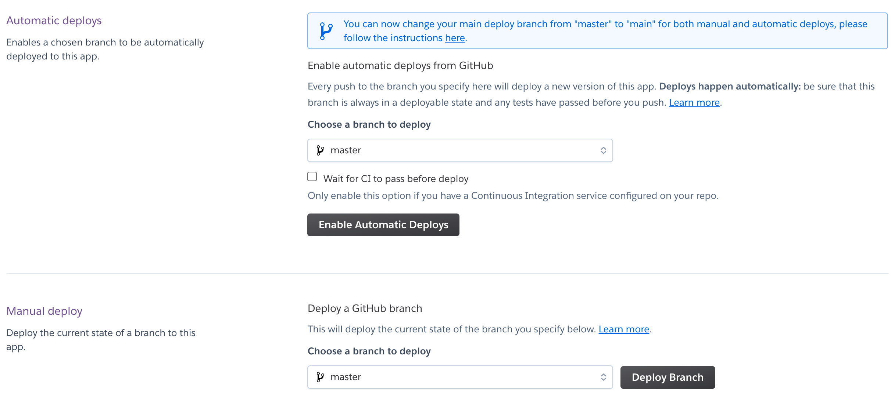
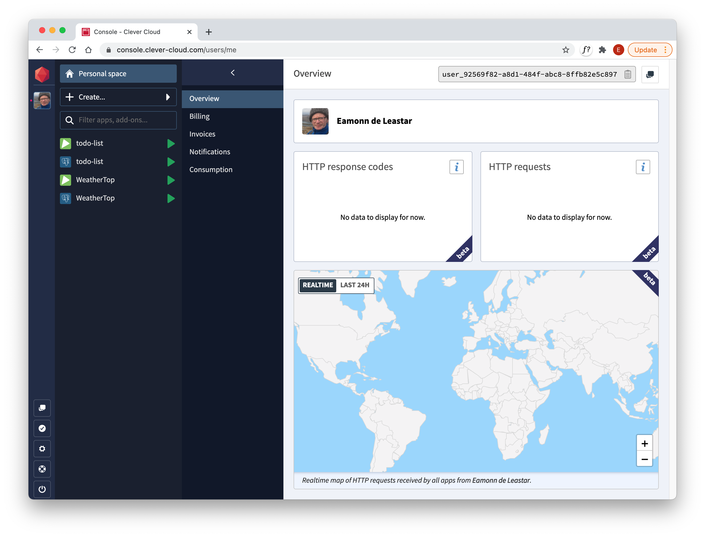

# Exercises

### Exercise 1: Update the application

Make a change to the application and redeploy it. You will need to commit and push the application  - and then re- deploy using the Heroku console:

Note in the above you can `Enable Automatic Deploys` - this will mean at app will be rebuilt every time you do a push to GitHub.

### Exercise 2: Deploy Playlist 5

Deploy the latest playlist application:

- <https://github.com/wit-hdip-comp-sci-2020/playlist/releases/tag/playlist.5.end>

You will need to follow precisely steps 02, 03 , 04 & 05 from this lab.

### Clever Cloud

An alternative to Heroku is Clevercloud:

- <https://www.clever-cloud.com/en/>

This is an interesting service - offering support for Play 1:

- <https://www.clever-cloud.com/doc/deploy/application/java/by-framework/play-framework-1/>

It offers a nice console - combined with good interactive technical support + a pay as you go model:

